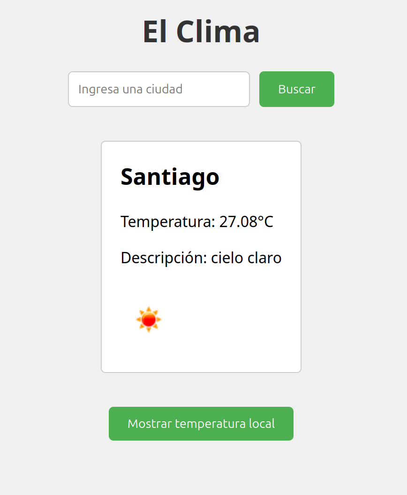
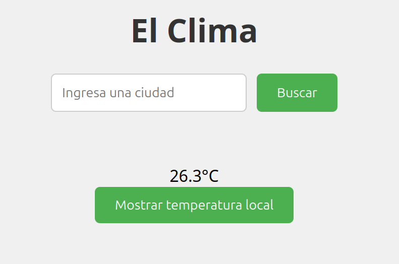

# Aplicación del Clima con Django

Este proyecto es una aplicación web desarrollada con Django que permite a los usuarios consultar información meteorológica de diferentes ciudades.

## Tabla de Contenidos

- [Descripción](#descripcion)
- [Funcionalidades](#funcionalidades)
- [Tecnologías utilizadas](#tecnologias)
- [Instalación](#instalacion)
- [Uso](#uso)
- [Contribución](#contribucion)
- [Licencia](#licencia)

## Descripción

Esta aplicación web utiliza la API de OpenWeatherMap para obtener datos meteorológicos en tiempo real. Los usuarios pueden ingresar el nombre de una ciudad y la aplicación mostrará la temperatura actual, descripción del clima e icono representativo.

## Funcionalidades

- Consulta de clima por ciudad
- Almacenamiento de ciudades consultadas (opcional, funcionando pero sin implementación)
- Visualización de temperatura, descripción e icono del clima
- Diseño responsivo (funcionando)

## Tecnologías utilizadas

- Python
- Django
- HTML
- CSS
- JavaScript
- OpenWeatherMap API